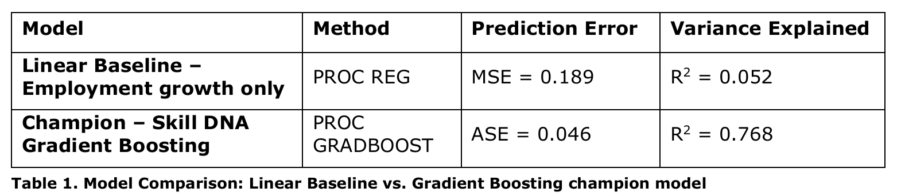
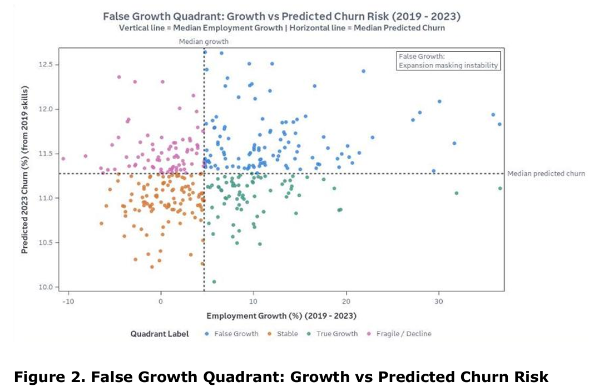
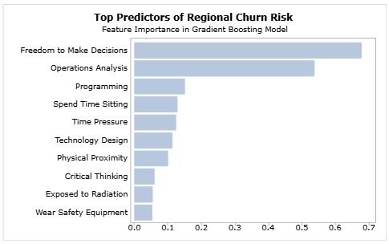
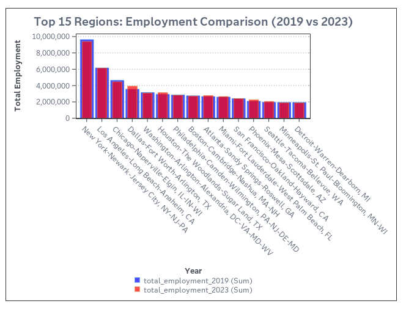

<p align="center">
  
</p>

<p align="center">
  
  
  
  
  
</p>

---

You treat employment growth as proof of economic strength, but hiring volume does not equal structural resilience. A city that hires 10,000 workers to replace 9,500 who left looks identical, on the headline, to one that created 10,000 new positions. Standard employment data cannot tell the two apart. This framework uses regional skill composition -- what we call "Skill DNA" -- to estimate churn risk and separate stable expansion from growth sustained by replacement hiring. The result: **61% of America's high-growth metro areas are growing on a foundation that is already cracking.**

> Full report: [Team-Outliers-Report.pdf](docs/Team-Outliers-Report.pdf)

---

<table width="100%">
<tr>
<td align="center" width="25%" valign="top">
<h1>114</h1>
False Growth<br>regions identified
</td>
<td align="center" width="25%" valign="top">
<h1>0.768</h1>
R² - Skill DNA<br>predicts 77% of churn
</td>
<td align="center" width="25%" valign="top">
<h1>15x</h1>
more explanatory power<br>than employment growth
</td>
<td align="center" width="25%" valign="top">
<h1>p < .0001</h1>
validated on held-out<br>2023 outcomes
</td>
</tr>
</table>

---

## Contents

| Section | What you'll find |
|:--------|:-----------------|
| [Project snapshot](#project-snapshot) | Quick-glance specs |
| [The problem](#the-problem) | Why employment growth lies |
| [Data](#data) | Three federal datasets, one Skill DNA profile |
| [Analysis](#analysis) | From raw data to a churn prediction model |
| [Structural classification](#structural-classification) | The quadrant that separates real growth from false |
| [Validation](#validation) | Three statistical tests on held-out 2023 data |
| [Key findings](#key-findings) | What actually drives workforce instability |
| [Business impact](#business-impact) | What a workforce board would do differently |
| [Reproduce it](#reproduce-it) | Clone, run, verify |

---

## Project snapshot

| | |
|:---|:---|
| **Domain** | Labor economics, workforce analytics |
| **Competition** | SAS Curiosity Cup 2026 |
| **Tools** | SAS Viya, Python, PROC GRADBOOST, PROC TTEST |
| **Methods** | Gradient boosting, quadrant classification, t-test validation |
| **Dataset** | 396 U.S. metro areas, 90 Skill DNA features, BLS + O\*NET |
| **Design** | Train on 2019, validate on 2023 (strict temporal holdout) |

---

## The problem

Las Vegas and San Jose, at opposite ends of the wage spectrum, expose the same measurement gap. After the pandemic, Las Vegas posted over 6% employment growth while hospitality turnover approached 85% and separations outpaced new hires by thousands per month. Nevada's chief economist called it not recovery but "restructuring." San Jose tells a parallel story: tech employment sat 37,000 jobs above pre-pandemic levels, yet engineers rotated between employers so fast that gross hiring amounted to expensive backfilling, not expansion.

In both cities, the employment numbers showed a thriving economy. The underlying workforce was falling apart.

| Metro | Headline | Reality |
|:------|:---------|:--------|
| Las Vegas | 6%+ job growth post-pandemic | Hospitality turnover hit 85% |
| San Jose | 37K jobs above pre-pandemic | Engineers rotating between employers |
| Phoenix | Fastest-growing metro | Warehouse churn replacing itself |

The cost of ignoring this is concrete. Without forward-looking indicators, policymakers and firms misread fragile regions as growth successes. Workforce development funds flow to places that appear healthy, and families relocate to cities whose economic foundations are weaker than the numbers suggest. Aggregate employment growth captures volume but says nothing about durability, retention, or whether underlying skill demands can sustain stability.

---

## Data

Three federal datasets, each answering a different question about regional workforces.

**1. The predictor dataset: O\*NET Skills and Work Context**

Qualitative vectors for over 800 occupations -- the Skills file (Complex Problem Solving, Critical Thinking) and the Work Context file (Consequence of Error, Time Pressure) quantify the structural resilience of each job. 55 work context + 35 skill ratings per occupation, scored on Importance and Level scales. This is the raw material of each occupation's Skill DNA.

Source: [O\*NET Resource Center](https://www.onetcenter.org/db_releases.html) (Database Version 24.0, Aug 2019 and Database Version 28.0, Aug 2023)

**2. The weighting dataset: BLS Occupational Employment and Wage Statistics (OEWS)**

Employment counts for every occupation in every U.S. Metropolitan Statistical Area. This localizes the national O\*NET data, calculating a weighted skill profile for specific cities (Detroit vs. San Francisco). Used to weight O\*NET skill vectors into region-level workforce profiles.

Source: [Bureau of Labor Statistics, OEWS](https://www.bls.gov/oes/tables.htm) (May 2019 and May 2023 MSA files)

**3. The target dataset: Labor turnover rates**

Total occupational separations rate (labor force exits + transfers). This is the ground truth for instability -- the target variable that Skill DNA is designed to predict.

Source: [BLS Employment Projections, Table 1.10](https://www.bls.gov/emp/data/projections-archive.htm) (released 2019 and released 2023)

**How they connect:** O\*NET skill and work-context scores, weighted by OEWS employment counts and averaged into each metro area's profile, produce the Skill DNA -- a 90-dimension fingerprint of what a region's workforce actually does. BLS separation rates, weighted the same way, form the target variable: regional churn rate. Neither exists in the raw data; both are constructed.

The final dataset: **396 metro areas x 92 variables** (90 Skill DNA predictors, one region identifier, one churn rate target). The four-year gap between training features (2019) and validation target (2023) is deliberate: can pre-pandemic skill structures anticipate post-pandemic instability?

---

## Analysis


All modeling runs in SAS Viya. Python handles initial file ingestion and column-name standardization across the three source datasets.

**Step 1 -- Baseline.** A linear regression with employment growth as the sole predictor of 2023 churn. R² = 0.052. Growth alone explains 5.2% of churn variation. It cannot capture structural labor-market dynamics.

**Step 2 -- Champion model.** A gradient boosting model trained on 2019 Skill DNA features to predict 2023 churn, partitioned 70/30 into training and validation within PROC GRADBOOST. The model converges at 60 trees with validation ASE of 0.046 and **R² = 0.768**: skill composition explains 76.8% of churn variation where employment growth explains 5.2%.

<p align="center">
  
</p>

Training and validation error remain stable. The model generalizes with limited overfitting.

---

## Structural classification

The model predicts churn, but prediction alone does not prove False Growth exists in the data. We construct the False Growth quadrant by pairing predicted churn with employment growth for all 396 MSAs. Both axes use data-driven median splits -- no arbitrary thresholds. High churn risk is predicted churn above the median (11.26%); high employment growth is growth above the median across regions.

<p align="center">
  
</p>

The upper-right quadrant is densely populated. False Growth is not a rare exception but a common outcome among high-growth regions.

<table width="100%">
<tr>
<td align="center" width="50%">
<h3>FALSE GROWTH -- 114 regions (61%)</h3>
<sub>High employment growth + High predicted churn<br><b>Expansion is masking instability</b></sub>
<br><sub>Avg churn: 11.66%</sub>
</td>
<td align="center" width="50%">
<h3>TRUE GROWTH -- 73 regions (39%)</h3>
<sub>High employment growth + Low predicted churn<br><b>Durable, skill-backed expansion</b></sub>
<br><sub>Avg churn: 10.99%</sub>
</td>
</tr>
<tr>
<td align="center" width="50%">
<h3>FRAGILE / DECLINE -- 84 regions</h3>
<sub>Low employment growth + High predicted churn<br>Visible decline -- everyone sees this</sub>
<br><sub>Avg churn: 11.56%</sub>
</td>
<td align="center" width="50%">
<h3>STABLE -- 125 regions</h3>
<sub>Low employment growth + Low predicted churn<br>Steady state -- no action needed</sub>
<br><sub>Avg churn: 10.94%</sub>
</td>
</tr>
</table>

---

## Validation

Three tests on held-out 2023 data the model never saw during training.

| Test | Question | Result | Verdict |
|:-----|:---------|:-------|:-------:|
| **Churn reality** | Do False Growth regions actually churn more? | 11.66% vs 10.99%, t = 13.35, **p < 0.0001** | Confirmed |
| **Employment illusion** | Can headline growth alone tell them apart? | 12.08% vs 10.33% -- nearly identical on a dashboard | No |
| **Concentration** | Is this a fringe finding? | 114 of 187 high-growth metros = **61%** | Majority |

The second row is the most important. False Growth and True Growth metros post almost identical employment growth numbers. A workforce board looking at a standard jobs dashboard would see no difference between them. The Skill DNA framework surfaces a distinction that conventional data hides entirely.

---

## Key findings

Skill composition explains 15x more churn variance than employment growth alone. The workforce's *composition* is a better predictor of its *stability* than the headline jobs number.

Feature importance analysis from the gradient boosting model points to autonomy and cognitive complexity as the primary drivers of churn risk:

<p align="center">
  
</p>

Freedom to Make Decisions is the strongest predictor (importance = 0.679), followed by Operations Analysis, Programming, Spend Time Sitting, and Time Pressure. Regions concentrated in occupations with limited autonomy and lower analytical demands face higher churn risk, even when employment is growing. Skill DNA reads the difference before employment data can.

<p align="center">
  
</p>

---

## Business impact

If a state workforce board looked at this before allocating their next round of WIOA funding, they would stop routing reskilling dollars exclusively to declining regions and start directing resources toward the 114 high-growth metros where the growth is structurally fragile.

A site-selection team evaluating Austin against Raleigh would ask not just "which metro is adding jobs faster?" but "which metro's job growth is backed by occupations that retain workers?"

Workforce agencies could integrate predicted churn into funding decisions to target reskilling investments toward False Growth regions before instability surfaces in headline employment data. That shifts funding from job-count incentives to resilience-based intervention.

Of 187 high-growth regions, 114 are False Growth. They experience significantly higher realized churn despite similar expansion rates. Employment growth reflects scale. Skill structure reflects resilience. When the two diverge -- as they do in the majority of high-growth American metro areas -- the headline numbers conceal more than they reveal.

---

## Reproduce it

**SAS Viya (primary modeling)**

```
1. Upload data/*.csv to SAS Viya
2. Run code/01_early_warning_model.sas
3. Train Gradient Boosting in SAS Visual Analytics
4. Run code/02_validation_and_classification.sas
```

**Python (preprocessing)**

```bash
git clone https://github.com/sai-seetal-pendyala/SAS-Curiosity-Cup-2026.git
cd SAS-Curiosity-Cup-2026
pip install -r requirements.txt
python code/preprocessing.py
```

**Data sources:** [O\*NET Resource Center](https://www.onetcenter.org/db_releases.html), [BLS OEWS](https://www.bls.gov/oes/tables.htm), [BLS Employment Projections](https://www.bls.gov/emp/data/projections-archive.htm)

---

<p align="center">
  Part of <b>Sai Seetal Pendyala</b>'s Analytics Portfolio<br>
  <a href="https://www.linkedin.com/in/sai-seetal-pendyala/">LinkedIn</a> · <a href="https://github.com/sai-seetal-pendyala">GitHub</a>
</p>
